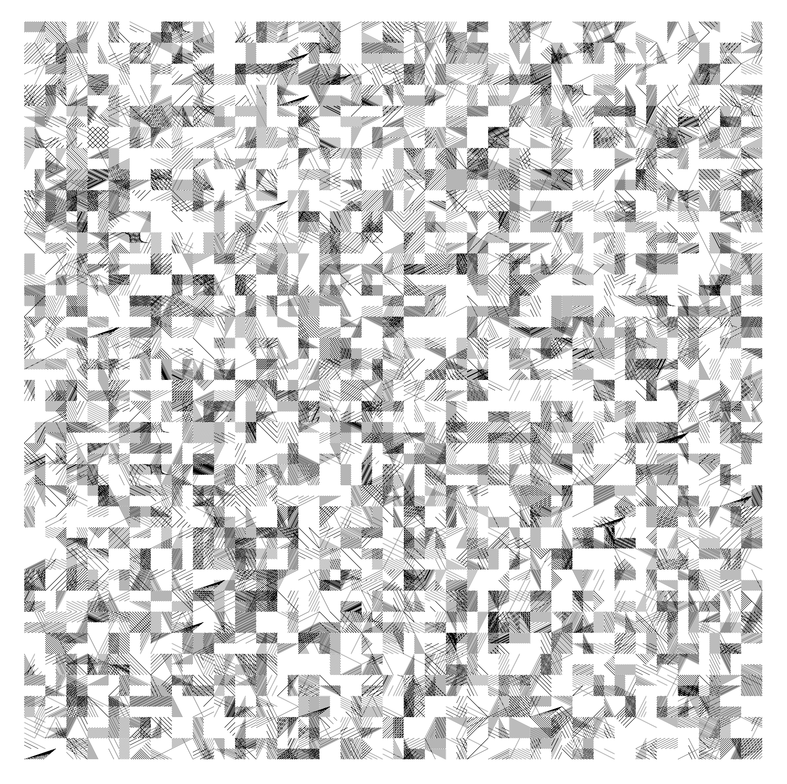
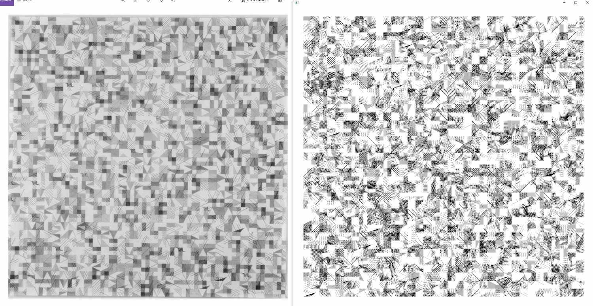
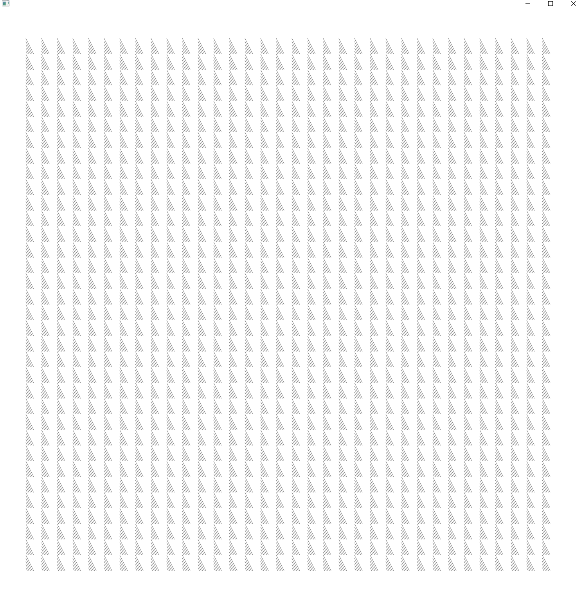
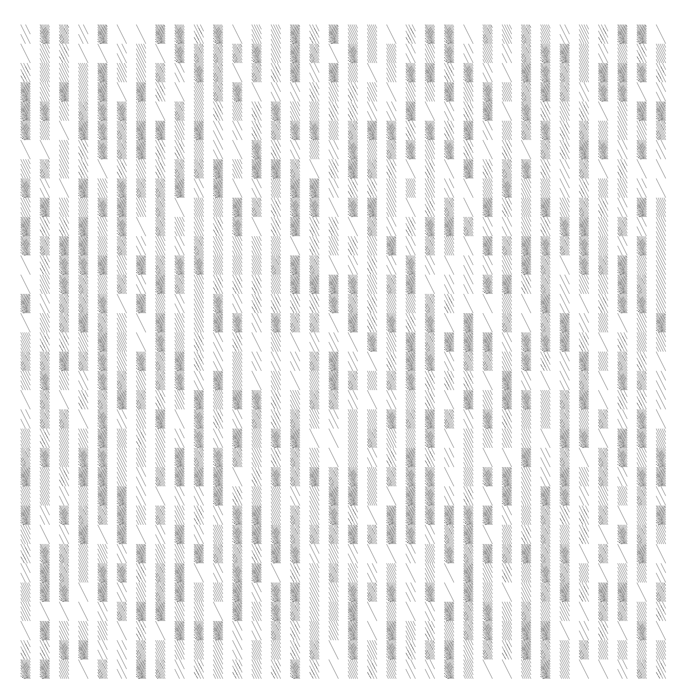
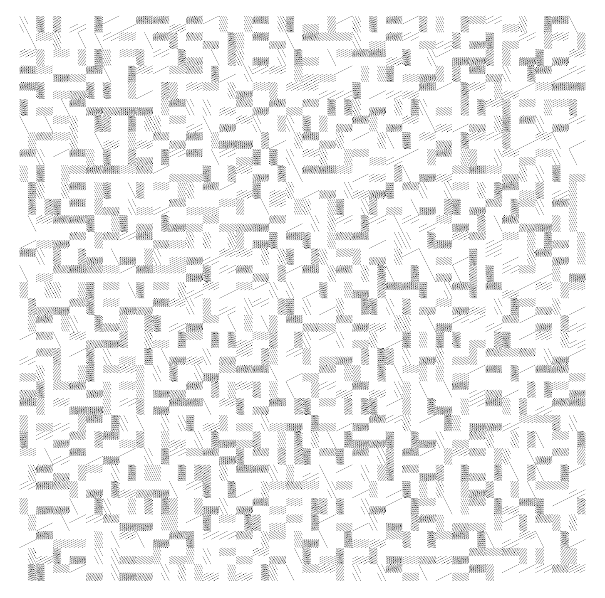
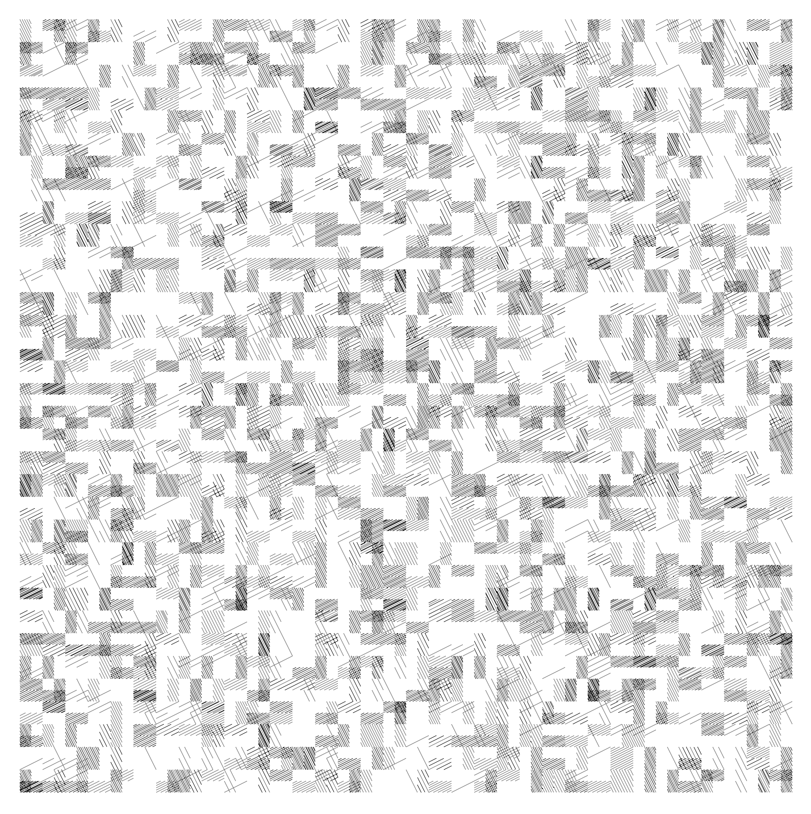
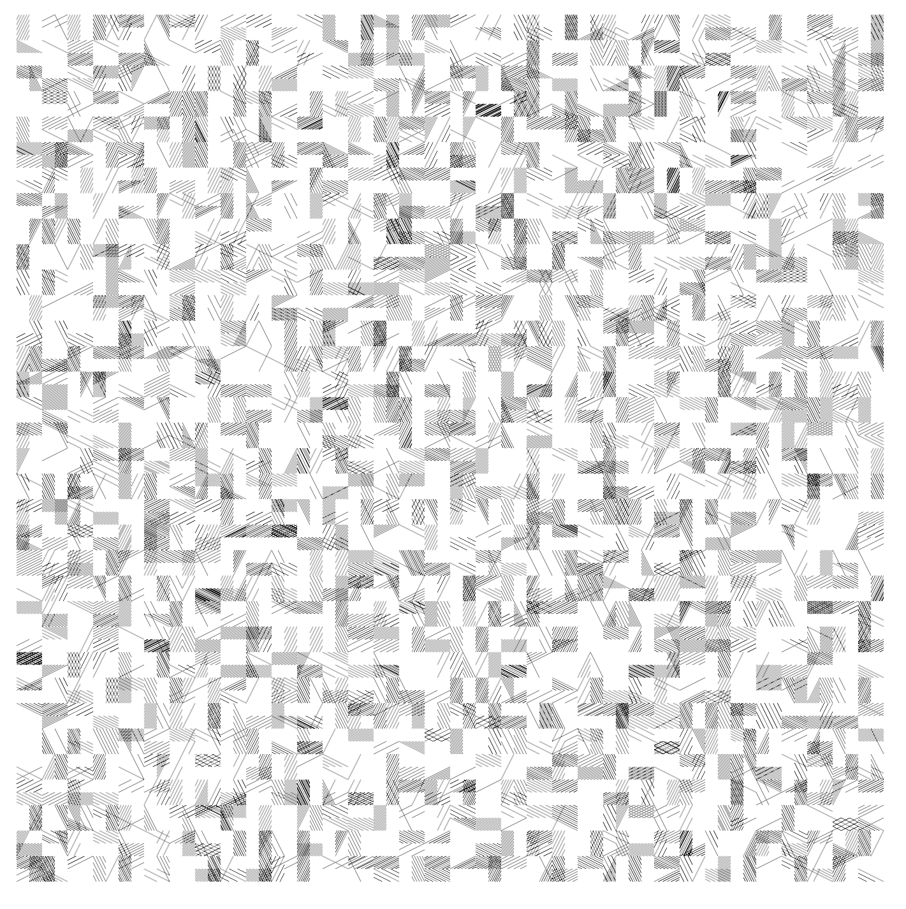
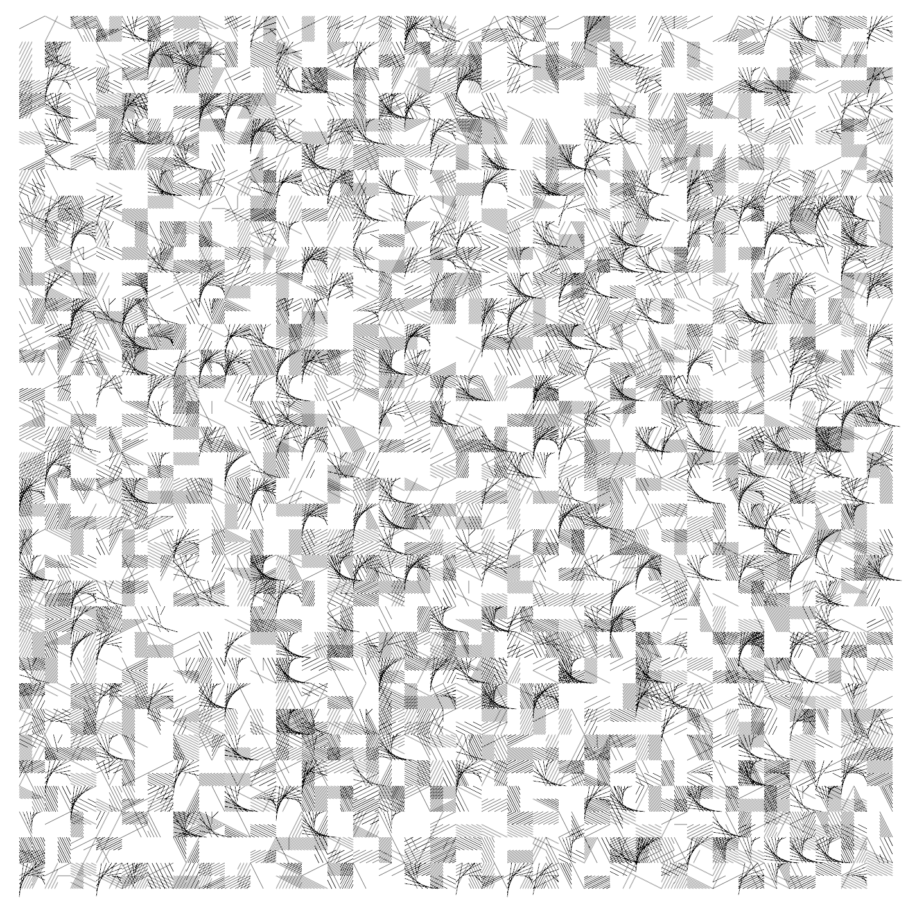

# After Vera Molnar after Klee

My attempt to reconstruct a beautiful Vera Molnar piece for the "Recreating the Past" Class taught by Zach Leiberman at the School for Poetic Computation.
WIP shots below:

This last one was a mistake but I liked it anyway.